# Settlement Automation Guide - ThetaPlay

> Complete guide for implementing a backend keeper bot to automatically settle expired options

## 🎯 Understanding Settlement Process

### Current Settlement Flow

**Important:** Position status **DOES NOT automatically update** when expired. Settlement requires manual transaction.

```mermaid
sequenceDiagram
    participant User
    participant Position as Position Registry
    participant Keeper as Keeper Bot
    participant Settlement as Settlement Contract
    participant Oracle as Price Oracle
    participant Vault as Payout Vault

    User->>Position: Buy Option (Status: ACTIVE)
    Note over Position: Position created with expiry timestamp
    
    loop Every N minutes
        Keeper->>Position: Query expired positions
        Position-->>Keeper: Returns expired ACTIVE positions
    end
    
    Note over Position: Time passes... expiry reached
    
    Keeper->>Settlement: settle(positionId) or settleBatch([ids])
    Settlement->>Position: Check expiry & status
    Settlement->>Oracle: getLatestPrice(asset)
    Oracle-->>Settlement: Current price
    Settlement->>Settlement: Calculate payout
    Settlement->>Position: setSettlement(id, price, payout)
    Note over Position: Status: ACTIVE → SETTLED
    
    User->>Vault: claim(positionId)
    Vault->>Position: Mark as CLAIMED
    Note over Position: Status: SETTLED → CLAIMED
```



### Status Lifecycle

```
┌─────────────┐
│   ACTIVE    │  ← Position created, waiting for expiry
└──────┬──────┘
       │ (Expiry reached, but status unchanged)
       │
       │ ⚠️  MANUAL SETTLEMENT REQUIRED
       │     (Keeper bot calls settle())
       ▼
┌─────────────┐
│   SETTLED   │  ← Settlement executed, payout calculated
└──────┬──────┘
       │
       │ (User calls claim())
       ▼
┌─────────────┐
│   CLAIMED   │  ← Payout withdrawn
└─────────────┘
```

**Key Points:**
- ✅ Status remains `ACTIVE` even after expiry timestamp passes
- ✅ Backend keeper **must call** `settle()` or `settleBatch()` 
- ✅ Only `onlyOwner` can settle positions
- ✅ Settlement fetches price from Chainlink Oracle automatically
- ✅ After settlement, users can claim their payouts

---

## 🤖 Keeper Bot Architecture

### Tech Stack

| Component | Technology | Purpose |
|-----------|-----------|---------|
| **Runtime** | Node.js 18+ | JavaScript runtime |
| **Blockchain** | Viem | Type-safe Ethereum library |
| **Scheduler** | node-cron | Periodic task execution |
| **Database** | PostgreSQL (optional) | Track settlement history |
| **Logging** | Pino | Structured logging |
| **Monitoring** | Prometheus (optional) | Metrics & alerting |

---

## 🚀 Implementation

### Step 1: Project Setup

```bash
# Create keeper bot project
mkdir thetaplay-keeper
cd thetaplay-keeper
npm init -y

# Install dependencies
npm install viem node-cron dotenv pino pino-pretty
npm install -D typescript @types/node ts-node
```

### Step 2: Configuration

**`.env`**

```bash
# RPC
SEPOLIA_RPC_URL=https://eth-sepolia.g.alchemy.com/v2/YOUR_KEY

# Private key with owner permissions
KEEPER_PRIVATE_KEY=0x...

# Contract addresses
POSITION_REGISTRY_ADDRESS=0x...
OPTION_SETTLEMENT_ADDRESS=0x...
PRICE_ORACLE_ADDRESS=0x...

# Keeper settings
CHECK_INTERVAL_MINUTES=5
BATCH_SIZE=10
GAS_PRICE_MULTIPLIER=1.1
MAX_GAS_PRICE_GWEI=50

# Monitoring (optional)
SLACK_WEBHOOK_URL=https://hooks.slack.com/...
```

### Step 3: Core Keeper Logic

**`src/keeper.ts`**

```typescript
import { 
  createPublicClient, 
  createWalletClient, 
  http,
  parseAbi,
  formatEther
} from 'viem'
import { privateKeyToAccount } from 'viem/accounts'
import { sepolia } from 'viem/chains'
import cron from 'node-cron'
import pino from 'pino'

// Logger
const logger = pino({
  transport: {
    target: 'pino-pretty',
    options: { colorize: true },
  },
})

// Blockchain clients
const publicClient = createPublicClient({
  chain: sepolia,
  transport: http(process.env.SEPOLIA_RPC_URL),
})

const account = privateKeyToAccount(process.env.KEEPER_PRIVATE_KEY as `0x${string}`)

const walletClient = createWalletClient({
  account,
  chain: sepolia,
  transport: http(process.env.SEPOLIA_RPC_URL),
})

// Contract ABIs (simplified)
const POSITION_REGISTRY_ABI = parseAbi([
  'function positions(uint256) view returns (tuple(address user, address collateralToken, uint256 premiumPaid, string underlyingAsset, bool isCall, bool isLong, uint256[] strikes, uint64 expiry, uint64 createdAt, uint8 status, bytes32 strategyId, address referrer, bytes32 orderHash, uint256 settlementPrice, uint256 payout, uint256 claimable, bool claimed))',
  'function getPositionsOf(address user) view returns (uint256[])',
])

const OPTION_SETTLEMENT_ABI = parseAbi([
  'function settle(uint256 id)',
  'function settleBatch(uint256[] ids)',
  'event PositionSettled(uint256 indexed id, string asset, uint256 settlementPrice, uint256 payout)',
])

const ADDRESSES = {
  POSITION_REGISTRY: process.env.POSITION_REGISTRY_ADDRESS as `0x${string}`,
  OPTION_SETTLEMENT: process.env.OPTION_SETTLEMENT_ADDRESS as `0x${string}`,
}

// Types
interface Position {
  id: bigint
  user: string
  underlyingAsset: string
  expiry: bigint
  status: number // 0=ACTIVE, 1=SETTLED, 2=CLAIMED
  premiumPaid: bigint
}

enum Status {
  ACTIVE = 0,
  SETTLED = 1,
  CLAIMED = 2,
}

/**
 * Fetch all positions from the registry
 * In production, use event logs or indexed database for efficiency
 */
async function getAllPositions(): Promise<Position[]> {
  const positions: Position[] = []
  
  // Strategy 1: Track position count (requires adding totalPositions() to contract)
  // For now, we'll query known position IDs (0 to maxId)
  
  // Strategy 2: Use event logs (recommended for production)
  const logs = await publicClient.getLogs({
    address: ADDRESSES.POSITION_REGISTRY,
    event: parseAbi(['event PositionAdded(uint256 indexed id, address indexed user, uint64 expiry, uint256 premiumPaid)'])[0],
    fromBlock: 0n, // Use deployment block in production
  })

  for (const log of logs) {
    const positionId = log.args.id!
    
    try {
      const rawPosition = await publicClient.readContract({
        address: ADDRESSES.POSITION_REGISTRY,
        abi: POSITION_REGISTRY_ABI,
        functionName: 'positions',
        args: [positionId],
      })

      positions.push({
        id: positionId,
        user: rawPosition.user,
        underlyingAsset: rawPosition.underlyingAsset,
        expiry: rawPosition.expiry,
        status: rawPosition.status,
        premiumPaid: rawPosition.premiumPaid,
      })
    } catch (error) {
      logger.error({ positionId, error }, 'Failed to fetch position')
    }
  }

  return positions
}

/**
 * Find positions that are expired but not yet settled
 */
function findExpiredPositions(positions: Position[]): Position[] {
  const now = BigInt(Math.floor(Date.now() / 1000))
  
  return positions.filter(p => 
    p.status === Status.ACTIVE && 
    p.expiry <= now
  )
}

/**
 * Settle a single position
 */
async function settlePosition(positionId: bigint) {
  try {
    logger.info({ positionId }, 'Settling position...')

    const { request } = await publicClient.simulateContract({
      account,
      address: ADDRESSES.OPTION_SETTLEMENT,
      abi: OPTION_SETTLEMENT_ABI,
      functionName: 'settle',
      args: [positionId],
    })

    const hash = await walletClient.writeContract(request)
    logger.info({ positionId, hash }, 'Settlement transaction sent')

    const receipt = await publicClient.waitForTransactionReceipt({ hash })
    logger.info({ positionId, hash, status: receipt.status }, 'Settlement confirmed')

    return { success: true, hash }
  } catch (error) {
    logger.error({ positionId, error }, 'Settlement failed')
    return { success: false, error }
  }
}

/**
 * Batch settle multiple positions (gas efficient)
 */
async function settleBatch(positionIds: bigint[]) {
  if (positionIds.length === 0) return

  try {
    logger.info({ count: positionIds.length, ids: positionIds }, 'Batch settling positions...')

    const { request } = await publicClient.simulateContract({
      account,
      address: ADDRESSES.OPTION_SETTLEMENT,
      abi: OPTION_SETTLEMENT_ABI,
      functionName: 'settleBatch',
      args: [positionIds],
    })

    const hash = await walletClient.writeContract(request)
    logger.info({ hash, count: positionIds.length }, 'Batch settlement transaction sent')

    const receipt = await publicClient.waitForTransactionReceipt({ hash })
    logger.info({ hash, status: receipt.status }, 'Batch settlement confirmed')

    return { success: true, hash, count: positionIds.length }
  } catch (error) {
    logger.error({ error, ids: positionIds }, 'Batch settlement failed')
    return { success: false, error }
  }
}

/**
 * Main keeper loop
 */
export async function runKeeperCheck() {
  logger.info('🔍 Starting keeper check...')

  try {
    // 1. Fetch all positions
    const allPositions = await getAllPositions()
    logger.info({ total: allPositions.length }, 'Fetched all positions')

    // 2. Find expired positions
    const expiredPositions = findExpiredPositions(allPositions)
    logger.info({ expired: expiredPositions.length }, 'Found expired positions')

    if (expiredPositions.length === 0) {
      logger.info('✅ No expired positions to settle')
      return
    }

    // 3. Batch settle (up to BATCH_SIZE at a time)
    const batchSize = parseInt(process.env.BATCH_SIZE || '10')
    const positionIds = expiredPositions.slice(0, batchSize).map(p => p.id)

    const result = await settleBatch(positionIds)

    if (result.success) {
      logger.info({ settled: result.count }, '✅ Settlement successful')
      
      // Send notification (optional)
      await sendNotification(`✅ Settled ${result.count} expired positions`)
    }

  } catch (error) {
    logger.error({ error }, '❌ Keeper check failed')
    await sendNotification(`❌ Keeper error: ${error.message}`)
  }
}

/**
 * Send notification to Slack/Discord/etc
 */
async function sendNotification(message: string) {
  if (!process.env.SLACK_WEBHOOK_URL) return

  try {
    await fetch(process.env.SLACK_WEBHOOK_URL, {
      method: 'POST',
      headers: { 'Content-Type': 'application/json' },
      body: JSON.stringify({ text: message }),
    })
  } catch (error) {
    logger.error({ error }, 'Failed to send notification')
  }
}

/**
 * Start keeper with cron schedule
 */
export function startKeeper() {
  const interval = process.env.CHECK_INTERVAL_MINUTES || '5'
  
  logger.info({ interval }, '🚀 Starting ThetaPlay Keeper Bot')
  logger.info({ account: account.address }, 'Keeper account')

  // Run immediately
  runKeeperCheck()

  // Schedule periodic checks
  cron.schedule(`*/${interval} * * * *`, () => {
    logger.info('⏰ Scheduled keeper check triggered')
    runKeeperCheck()
  })

  logger.info(`✅ Keeper scheduled to run every ${interval} minutes`)
}

// Start keeper bot
if (require.main === module) {
  startKeeper()
}
```

### Step 4: Optimized Event-based Approach

For production, use event logs instead of querying all positions:

**`src/event-keeper.ts`**

```typescript
import { createPublicClient, http, parseAbiItem } from 'viem'
import { sepolia } from 'viem/chains'

const publicClient = createPublicClient({
  chain: sepolia,
  transport: http(process.env.SEPOLIA_RPC_URL),
})

/**
 * Track positions using event logs (more efficient)
 */
async function getExpiredPositionsFromEvents(): Promise<bigint[]> {
  const now = BigInt(Math.floor(Date.now() / 1000))
  
  // 1. Get all PositionAdded events
  const createdLogs = await publicClient.getLogs({
    address: ADDRESSES.POSITION_REGISTRY,
    event: parseAbiItem('event PositionAdded(uint256 indexed id, address indexed user, uint64 expiry, uint256 premiumPaid)'),
    fromBlock: 'earliest', // Cache this in production
  })

  // 2. Get all PositionSettled events
  const settledLogs = await publicClient.getLogs({
    address: ADDRESSES.OPTION_SETTLEMENT,
    event: parseAbiItem('event PositionSettled(uint256 indexed id, string asset, uint256 settlementPrice, uint256 payout)'),
    fromBlock: 'earliest',
  })

  const settledIds = new Set(settledLogs.map(log => log.args.id!))

  // 3. Filter: created && expired && not settled
  const expiredIds = createdLogs
    .filter(log => {
      const positionId = log.args.id!
      const expiry = log.args.expiry!
      
      return expiry <= now && !settledIds.has(positionId)
    })
    .map(log => log.args.id!)

  return expiredIds
}
```

---

## 📊 Monitoring & Metrics

### Health Checks

**`src/health.ts`**

```typescript
import express from 'express'

const app = express()

let lastCheckTime: number = 0
let lastSettlementCount: number = 0

app.get('/health', (req, res) => {
  const isHealthy = Date.now() - lastCheckTime < 10 * 60 * 1000 // 10 min
  
  res.status(isHealthy ? 200 : 503).json({
    status: isHealthy ? 'healthy' : 'unhealthy',
    lastCheck: new Date(lastCheckTime).toISOString(),
    lastSettlementCount,
    uptime: process.uptime(),
  })
})

app.listen(3000, () => {
  console.log('Health check server running on port 3000')
})
```

### Metrics Collection

```typescript
import { Registry, Counter, Gauge, Histogram } from 'prom-client'

const register = new Registry()

const settlementsTotal = new Counter({
  name: 'thetaplay_settlements_total',
  help: 'Total number of positions settled',
  registers: [register],
})

const gasUsed = new Histogram({
  name: 'thetaplay_gas_used',
  help: 'Gas used for settlement transactions',
  registers: [register],
})

const activePositions = new Gauge({
  name: 'thetaplay_active_positions',
  help: 'Number of active positions',
  registers: [register],
})
```

---

## 🚀 Deployment

### Docker Setup

**`Dockerfile`**

```dockerfile
FROM node:18-alpine

WORKDIR /app

COPY package*.json ./
RUN npm ci --only=production

COPY . .

CMD ["node", "dist/keeper.js"]
```

**`docker-compose.yml`**

```yaml
version: '3.8'

services:
  keeper:
    build: .
    env_file: .env
    restart: unless-stopped
    logging:
      driver: json-file
      options:
        max-size: "10m"
        max-file: "3"
```

### Deploy to Cloud

#### Option 1: Heroku

```bash
heroku create thetaplay-keeper
heroku config:set SEPOLIA_RPC_URL=...
heroku config:set KEEPER_PRIVATE_KEY=...
git push heroku main
```

#### Option 2: Railway

```bash
railway init
railway add
railway up
```

#### Option 3: AWS Lambda (Serverless)

For serverless, trigger the keeper via CloudWatch Events every 5 minutes:

```typescript
// lambda/handler.ts
export const handler = async (event: any) => {
  await runKeeperCheck()
  return { statusCode: 200, body: 'Keeper check completed' }
}
```

---

## 🔐 Security Best Practices

### 1. Private Key Management

```bash
# Use AWS Secrets Manager
aws secretsmanager create-secret \
  --name thetaplay/keeper-private-key \
  --secret-string "0x..."

# Retrieve in code
const secret = await secretsManager.getSecretValue({ SecretId: 'thetaplay/keeper-private-key' }).promise()
const privateKey = secret.SecretString
```

### 2. Gas Price Protection

```typescript
const maxGasPrice = parseGwei(process.env.MAX_GAS_PRICE_GWEI || '50')
const currentGasPrice = await publicClient.getGasPrice()

if (currentGasPrice > maxGasPrice) {
  logger.warn({ currentGasPrice, maxGasPrice }, 'Gas price too high, skipping')
  return
}
```

### 3. Transaction Failure Handling

```typescript
async function settleWithRetry(positionId: bigint, maxRetries = 3) {
  for (let i = 0; i < maxRetries; i++) {
    try {
      return await settlePosition(positionId)
    } catch (error) {
      if (i === maxRetries - 1) throw error
      await new Promise(r => setTimeout(r, 1000 * (i + 1))) // Exponential backoff
    }
  }
}
```

---

## 📈 Performance Optimization

### Batch Processing Strategy

```typescript
// Process in batches to avoid RPC rate limits
async function processBatches(positions: Position[], batchSize = 10) {
  for (let i = 0; i < positions.length; i += batchSize) {
    const batch = positions.slice(i, i + batchSize)
    const ids = batch.map(p => p.id)
    
    await settleBatch(ids)
    
    // Rate limit protection
    await new Promise(r => setTimeout(r, 1000))
  }
}
```

### Database Caching

```typescript
// Cache position data to reduce RPC calls
import { Pool } from 'pg'

const pool = new Pool({ connectionString: process.env.DATABASE_URL })

async function cachePosition(position: Position) {
  await pool.query(
    `INSERT INTO positions (id, user, asset, expiry, status, last_updated)
     VALUES ($1, $2, $3, $4, $5, NOW())
     ON CONFLICT (id) DO UPDATE SET status = $5, last_updated = NOW()`,
    [position.id, position.user, position.underlyingAsset, position.expiry, position.status]
  )
}
```

---

## ✅ Testing

### Unit Tests

```typescript
import { describe, it, expect } from 'vitest'

describe('Keeper Logic', () => {
  it('should identify expired positions', () => {
    const positions = [
      { id: 1n, expiry: BigInt(Date.now() / 1000 - 3600), status: 0 }, // Expired
      { id: 2n, expiry: BigInt(Date.now() / 1000 + 3600), status: 0 }, // Not expired
    ]
    
    const expired = findExpiredPositions(positions)
    expect(expired).toHaveLength(1)
    expect(expired[0].id).toBe(1n)
  })
})
```

### Integration Tests

```bash
# Test on Sepolia testnet
npm run keeper:test
```

---

## 🎯 Summary

### Keeper Bot Responsibilities

1. ✅ **Monitor** - Query blockchain for expired positions
2. ✅ **Settle** - Call `settleBatch()` with expired position IDs
3. ✅ **Log** - Track settlement history and metrics
4. ✅ **Alert** - Notify team of failures or issues
5. ✅ **Optimize** - Batch processing for gas efficiency

### Key Points

- ⚠️ **Manual Settlement Required** - Positions don't auto-settle
- 🔐 **Only Owner** - Settlement contract must have owner permissions
- 📊 **Oracle Integration** - Price automatically fetched from Chainlink
- 🚀 **Batch Efficient** - Settle multiple positions in one transaction
- 🔄 **Continuous Monitoring** - Run keeper every 5-10 minutes

Your backend keeper is now ready to automate ThetaPlay settlements! 🎉
