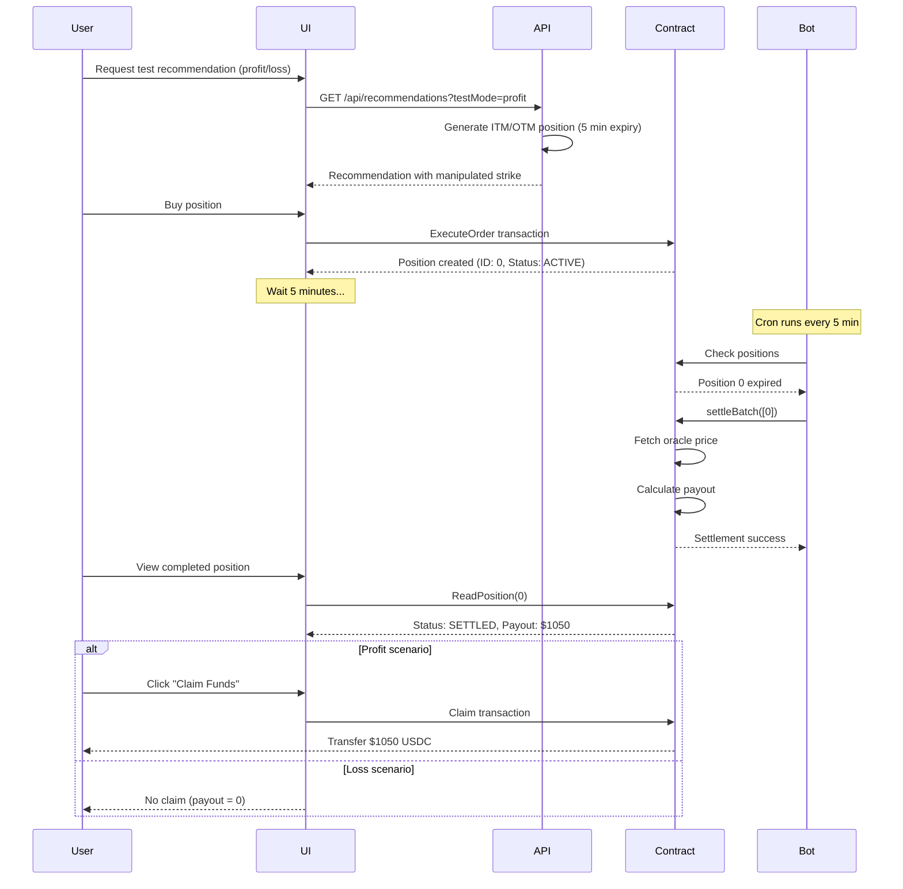

# Settlement Testing Guide

Guide untuk test settlement bot dengan 2 scenario: Profit dan Loss

## 🎯 Test Scenarios

### Scenario 1: PROFIT (User Untung) ✅

User beli option yang **sudah In-The-Money (ITM)** - langsung untung!

**How it works:**
- CALL option dengan strike **30% DI BAWAH** current price
- Contoh: ETH price $3500, strike $2450
- Intrinsic value: $1050 ($3500 - $2450)
- Premium: ~$5
- **Guaranteed profit:** ~$1045 saat settlement

### Scenario 2: LOSS (User Rugi) ❌

User beli option yang **Out-of-The-Money (OTM)** - expire worthless!

**How it works:**
- CALL option dengan strike **50% DI ATAS** current price
- Contoh: ETH price $3500, strike $5250
- Intrinsic value: $0 (price below strike)
- Premium: ~$5
- **Guaranteed loss:** Premium ($5) lost

---

## 🚀 Testing Steps

### Step 1: Generate Test Recommendations

**For PROFIT scenario:**
```bash
curl "http://localhost:3000/api/recommendations?goal=CAPTURE_UPSIDE&riskComfort=MODERATE&confidence=HIGH&amount=100&testMode=profit"
```

**For LOSS scenario:**
```bash
curl "http://localhost:3000/api/recommendations?goal=CAPTURE_UPSIDE&riskComfort=MODERATE&confidence=HIGH&amount=100&testMode=loss"
```

**Expected response:**
```json
{
  "success": true,
  "recommendations": [
    {
      "id": "TEST-PROFIT-ETH-1738256789",
      "asset": "ETH",
      "type": "CALL",
      "currentPrice": 3500,
      "strike": 2450,  // 30% below for profit
      "expiry": 1738257089,  // 5 minutes from now
      "premium": 5,
      "metadata": {
        "explanation": "🎯 TEST PROFIT: Strike $2450 is 30% BELOW current $3500. Position will be profitable at settlement!",
        "daysToExpiry": 5  // minutes
      }
    }
  ]
}
```

### Step 2: Buy Position via UI

1. Open trade page di UI
2. Click recommendation
3. Buy position
4. Wait for transaction confirm

Position akan terlihat di Activity Modal dengan:
- **Status:** ACTIVE
- **Expiry:** 5 minutes
- **Unrealized PnL:** 
  - Profit scenario: +$1000 (untung besar!)
  - Loss scenario: -$5 (rugi premium)

### Step 3: Wait for Expiry (5 minutes)

Position akan expired setelah 5 menit.

Check countdown di UI:
```
Expires in... 4m 32s
Expires in... 3m 15s
Expires in... 1m 00s
Expired! Waiting for settlement...
```

### Step 4: Settlement Bot Auto-Settle

Bot keeper akan auto-detect expired position dalam max 5 menit (cron interval).

Atau test manual:
```bash
curl http://localhost:3000/api/cron/settle
```

Expected response:
```json
{
  "success": true,
  "settled": 1,
  "txHash": "0x..."
}
```

### Step 5: Check Settlement Results

Di Activity/Completed Modal:

**PROFIT scenario:**
- Settlement Price: $3500
- Payout: $1050 (intrinsic value)
- Premium Paid: $5
- **Net P&L: +$1045** 🎉

**LOSS scenario:**
- Settlement Price: $3500
- Payout: $0 (OTM)
- Premium Paid: $5
- **Net P&L: -$5** 💸

### Step 6: Claim Funds (Profit only)

For profitable positions:
```
Position Settled → Status: SETTLED
User clicks "Claim Funds" → Status: CLAIMED
Funds transferred to wallet ✅
```

For loss positions:
```
Position Settled → Status: SETTLED
No claim button (payout = 0)
Premium lost to market maker
```

---

## 📊 Complete Test Flow



---

## 🧪 Test Matrix

| Scenario | Strike vs Price | Expiry | Expected PnL | Settlement Time |
|----------|----------------|--------|--------------|-----------------|
| **PROFIT** | -30% (ITM) | 5 min | +$1000 | ~10 min total |
| **LOSS** | +50% (OTM) | 5 min | -$5 | ~10 min total |

---

## 💡 Tips

### Quick Reset Testing

Untuk test ulang:
1. Buy new position dengan testMode berbeda
2. Wait 5 minutes
3. Settlement bot auto-settle
4. Check results

### Monitor Bot Logs

Terminal will show:
```
[Keeper] Found position 0 (status: 0, expiry: 1738257089)
[Keeper] Found 1 expired positions
[Keeper] Settling batch of 1 positions
[Keeper] ✅ Successfully settled 1 positions
```

### Check on Blockchain

View transaction di Base Sepolia explorer:
- Settlement transaction
- PositionSettled events
- Payout amounts

---

## 🎯 Success Criteria

✅ **PROFIT scenario:**
- Position bought at strike $2450
- Settled at price $3500
- Payout: $1050
- Net profit: +$1045

✅ **LOSS scenario:**
- Position bought at strike $5250
- Settled at price $3500
- Payout: $0
- Net loss: -$5 (premium)

✅ **Bot performance:**
- Auto-detect expired positions
- Settle within 5 minutes of expiry
- Transaction confirmed on blockchain

---

## 🚨 Troubleshooting

**Position not expiring?**
- Check server time vs expiry timestamp
- Expiry calculated: `Date.now() + 5 minutes`

**Bot not settling?**
- Check cron logs: `vercel logs --follow`
- Manual trigger: `curl http://localhost:3000/api/cron/settle`

**Wrong PnL calculation?**
- Verify strike price in contract matches recommendation
- Check oracle price used for settlement
- Formula: `payout = max(0, currentPrice - strike)` for CALL

Happy testing! 🎉
